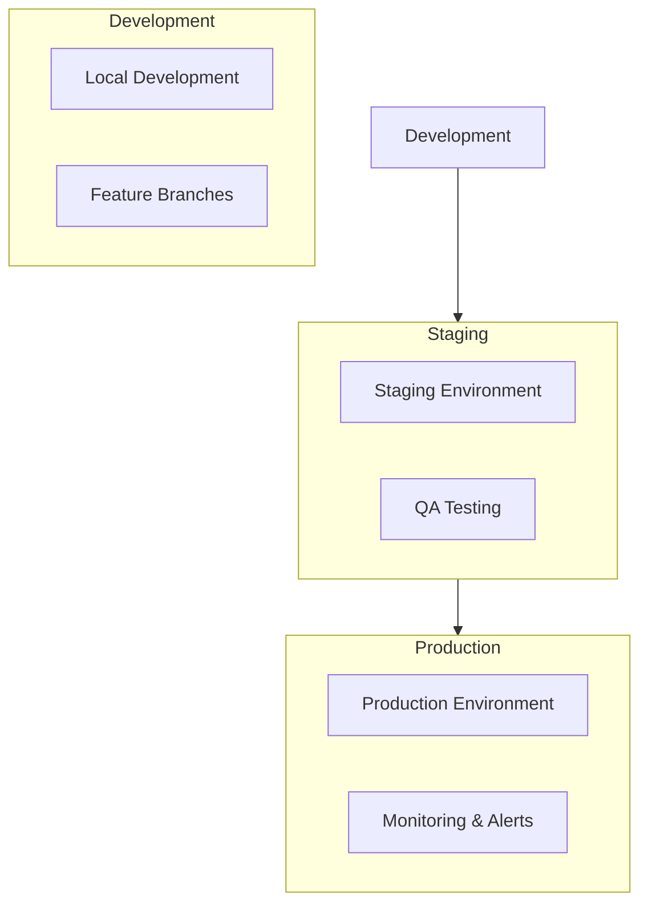

# Deployment Strategy and Infrastructure Documentation

## Infrastructure Overview

Our deployment strategy leverages Vercel and Supabase for a simplified, maintainable infrastructure. We focus on automated deployments and consistent environments.

### Key Principles
- Vercel for frontend deployment
- Supabase for backend services
- Automated deployment pipeline
- Environment parity
- Simple rollback procedures

### Environment Strategy


### Cloud Resources (Vercel + Supabase)
- Next.js Frontend (Vercel)
- API Routes (Vercel Serverless)
- Database (Supabase)
- File Storage (Supabase Storage)
- Authentication (Supabase Auth)
- Edge Functions (Vercel Edge)

## Deployment Pipeline

### CI/CD Configuration (GitHub Actions)
```yaml
name: Deployment Pipeline

on:
  push:
    branches: [ main, staging ]
  pull_request:
    branches: [ main, staging ]

jobs:
  validate:
    runs-on: ubuntu-latest
    steps:
      - uses: actions/checkout@v3
      
      - name: Setup Node.js
        uses: actions/setup-node@v3
        with:
          node-version: '18'
          
      - name: Install dependencies
        run: npm ci
        
      - name: Type check
        run: npm run type-check
        
      - name: Lint
        run: npm run lint
        
      - name: Test
        run: npm run test
        
      - name: Build
        run: npm run build

  deploy-staging:
    needs: validate
    if: github.ref == 'refs/heads/staging'
    runs-on: ubuntu-latest
    steps:
      - name: Deploy to Vercel (Staging)
        uses: vercel/action@v3
        with:
          vercel-token: ${{ secrets.VERCEL_TOKEN }}
          vercel-org-id: ${{ secrets.ORG_ID}}
          vercel-project-id: ${{ secrets.PROJECT_ID }}
          vercel-args: '--prebuilt --prod'
          working-directory: ./

  deploy-production:
    needs: validate
    if: github.ref == 'refs/heads/main'
    runs-on: ubuntu-latest
    environment: production
    steps:
      - name: Deploy to Vercel (Production)
        uses: vercel/action@v3
        with:
          vercel-token: ${{ secrets.VERCEL_TOKEN }}
          vercel-org-id: ${{ secrets.ORG_ID}}
          vercel-project-id: ${{ secrets.PROJECT_ID }}
          vercel-args: '--prebuilt --prod'
          working-directory: ./
```

## Environment Configuration

### Environment Variables
```typescript
// src/config/environment.ts
interface Environment {
  NEXT_PUBLIC_SUPABASE_URL: string;
  NEXT_PUBLIC_SUPABASE_ANON_KEY: string;
  WHATSAPP_API_KEY: string;
  WHATSAPP_VERIFY_TOKEN: string;
  ENCRYPTION_KEY: string;
  NODE_ENV: 'development' | 'staging' | 'production';
}

// Validation using Zod
const envSchema = z.object({
  NEXT_PUBLIC_SUPABASE_URL: z.string().url(),
  NEXT_PUBLIC_SUPABASE_ANON_KEY: z.string().min(1),
  WHATSAPP_API_KEY: z.string().min(1),
  WHATSAPP_VERIFY_TOKEN: z.string().min(1),
  ENCRYPTION_KEY: z.string().min(32),
  NODE_ENV: z.enum(['development', 'staging', 'production'])
});

// Validate environment
const env = envSchema.parse(process.env);
```

### Secrets Management
```yaml
# .github/workflows/secrets-check.yml
name: Secrets Check

on: [pull_request]

jobs:
  check-secrets:
    runs-on: ubuntu-latest
    steps:
      - uses: actions/checkout@v3
      
      - name: Check for secrets
        uses: gitleaks/gitleaks-action@v2
        env:
          GITHUB_TOKEN: ${{ secrets.GITHUB_TOKEN }}
```

## Infrastructure as Code

### Vercel Configuration
```json
{
  "version": 2,
  "builds": [
    {
      "src": "next.config.js",
      "use": "@vercel/next"
    }
  ],
  "routes": [
    {
      "src": "/api/webhooks/whatsapp",
      "methods": ["POST"],
      "headers": {
        "Access-Control-Allow-Origin": "*"
      }
    }
  ],
  "env": {
    "NEXT_PUBLIC_SUPABASE_URL": "@supabase_url",
    "NEXT_PUBLIC_SUPABASE_ANON_KEY": "@supabase_anon_key"
  }
}
```

### Database Migrations
```sql
-- migrations/001_initial_schema.sql
CREATE EXTENSION IF NOT EXISTS "uuid-ossp";

CREATE TABLE users (
  id UUID PRIMARY KEY DEFAULT uuid_generate_v4(),
  email TEXT UNIQUE NOT NULL,
  -- ... rest of schema
);

-- migrations/002_add_indexes.sql
CREATE INDEX idx_users_email ON users(email);
CREATE INDEX idx_journal_entries_user_id ON journal_entries(user_id);
```

## Monitoring and Observability

### Application Monitoring
```typescript
// src/lib/monitoring.ts
import * as Sentry from '@sentry/nextjs';

export function initializeMonitoring() {
  if (process.env.NODE_ENV === 'production') {
    Sentry.init({
      dsn: process.env.SENTRY_DSN,
      tracesSampleRate: 0.1,
      environment: process.env.NODE_ENV
    });
  }
}

// Error Boundary Component
export class ErrorBoundary extends React.Component {
  componentDidCatch(error: Error, errorInfo: React.ErrorInfo) {
    Sentry.captureException(error, { extra: errorInfo });
  }
}
```

### Performance Monitoring
```typescript
// src/lib/analytics.ts
export function trackPerformanceMetrics() {
  if (typeof window !== 'undefined') {
    const metrics = {
      FCP: performance.getEntriesByName('first-contentful-paint')[0],
      LCP: performance.getEntriesByName('largest-contentful-paint')[0],
      FID: performance.getEntriesByName('first-input-delay')[0]
    };
    
    // Send metrics to monitoring service
    sendMetrics(metrics);
  }
}
```

## Scaling Strategy

### Database Scaling
```typescript
// src/lib/database.ts
export const pool = new Pool({
  max: 20,
  idleTimeoutMillis: 30000,
  connectionTimeoutMillis: 2000,
});

// Connection management
export async function withConnection<T>(
  callback: (client: PoolClient) => Promise<T>
): Promise<T> {
  const client = await pool.connect();
  try {
    return await callback(client);
  } finally {
    client.release();
  }
}
```

### Cache Strategy
```typescript
// src/lib/cache.ts
import { Redis } from 'ioredis';

const redis = new Redis(process.env.REDIS_URL);

export async function getCachedData<T>(
  key: string,
  fetchFn: () => Promise<T>,
  ttl: number = 3600
): Promise<T> {
  const cached = await redis.get(key);
  if (cached) return JSON.parse(cached);
  
  const data = await fetchFn();
  await redis.setex(key, ttl, JSON.stringify(data));
  return data;
}
```

## Disaster Recovery

### Backup Strategy
```typescript
// scripts/backup.ts
async function createBackup() {
  // Database backup
  const timestamp = new Date().toISOString();
  const filename = `backup-${timestamp}.sql`;
  
  // Execute pg_dump
  await exec(`pg_dump ${DATABASE_URL} > ${filename}`);
  
  // Upload to secure storage
  await uploadToStorage(filename);
  
  // Notify team
  await sendNotification(`Backup completed: ${filename}`);
}
```

### Recovery Procedures
```typescript
// scripts/recovery.ts
async function performRecovery(backupFile: string) {
  // Verify backup file
  if (!await verifyBackup(backupFile)) {
    throw new Error('Backup verification failed');
  }
  
  // Restore database
  await exec(`psql ${DATABASE_URL} < ${backupFile}`);
  
  // Verify restoration
  await verifyRestoration();
  
  // Update monitoring
  await updateRecoveryStatus('completed');
}
```

## Security Measures

### SSL Configuration
```typescript
// next.config.js
module.exports = {
  async headers() {
    return [
      {
        source: '/:path*',
        headers: [
          {
            key: 'Strict-Transport-Security',
            value: 'max-age=31536000; includeSubDomains'
          },
          {
            key: 'X-Frame-Options',
            value: 'DENY'
          },
          {
            key: 'X-Content-Type-Options',
            value: 'nosniff'
          }
        ]
      }
    ];
  }
};
```

### Rate Limiting
```typescript
// src/middleware.ts
import rateLimit from 'express-rate-limit';

export const apiLimiter = rateLimit({
  windowMs: 15 * 60 * 1000, // 15 minutes
  max: 100, // Limit each IP to 100 requests per windowMs
  message: 'Too many requests from this IP'
});
```

## Feature Flags
```typescript
// src/lib/features.ts
interface FeatureFlags {
  enableBetaFeatures: boolean;
  enableNewJournalUI: boolean;
  enableAnalytics: boolean;
}

export const getFeatureFlags = async (userId: string): Promise<FeatureFlags> => {
  return await getCachedData(
    `feature-flags:${userId}`,
    async () => {
      const flags = await supabase
        .from('feature_flags')
        .select('*')
        .eq('user_id', userId)
        .single();
      return flags.data;
    },
    300 // 5 minute cache
  );
};
```

## Rollback Procedures

### Automated Rollback
```yaml
name: Rollback

on:
  workflow_dispatch:
    inputs:
      version:
        description: 'Version to rollback to'
        required: true

jobs:
  rollback:
    runs-on: ubuntu-latest
    steps:
      - name: Checkout specific version
        uses: actions/checkout@v3
        with:
          ref: ${{ github.event.inputs.version }}
          
      - name: Deploy previous version
        uses: vercel/action@v3
        with:
          vercel-token: ${{ secrets.VERCEL_TOKEN }}
          vercel-args: '--prod'
```

## Development Setup for Cursor

### VSCode Configuration
```json
{
  "editor.formatOnSave": true,
  "editor.codeActionsOnSave": {
    "source.fixAll.eslint": true
  },
  "typescript.tsdk": "node_modules/typescript/lib",
  "[typescript]": {
    "editor.defaultFormatter": "esbenp.prettier-vscode"
  },
  "[typescriptreact]": {
    "editor.defaultFormatter": "esbenp.prettier-vscode"
  }
}
```

### Cursor-Specific Settings
```json
{
  "cursor.showInlineCompletions": true,
  "cursor.displayMode": "inline",
  "cursor.enableTelemetry": false
}
```
